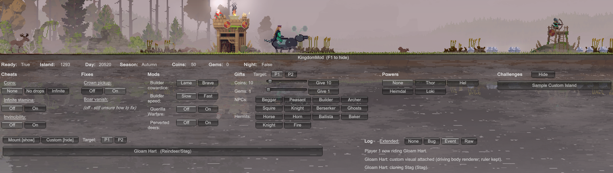

# KingdomMod

A community modding platform for **Kingdom Two Crowns** on Windows.

KingdomMod provides a MelonLoader-based runtime, a small C# SDK, an in-game F1
console, and example mods for balance tweaks, UI overlays, hotkeys, mounts,
tree behavior, sprite replacement, and custom challenge/island recipes.

[](https://discord.gg/VpuCg6Hcrs)

Join the [KingdomMod Discord](https://discord.gg/VpuCg6Hcrs) to share mods,
ask questions, and help grow the Kingdom Two Crowns modding community.

> You must own Kingdom Two Crowns. KingdomMod ships no game code and no game
> assets. Developer reference assemblies are generated locally from your own
> game install and are never redistributed.

## Preview




[Watch the full-quality MP4 demo](docs/media/kingdommod-f1-gloam-hart-demo.mp4).

## Install

1. Download [`KingdomMod-<version>-x64.msi`](https://github.com/FredApps/KingdomMod/releases) from the latest GitHub Release.
2. Run the MSI.
3. Confirm or browse to your Kingdom Two Crowns folder.
4. Enable the required Windows Defender exclusion checkbox when prompted.
5. Let the installer run its setup pass if interop references must be
   generated. This first pass can take several minutes.
6. Launch the game normally.
7. Press **F1** in-game to open the KingdomMod console.

If Windows SmartScreen blocks the installer, choose **More info** and then
**Run anyway**. This warning appears because KingdomMod's MSI is a new,
community-built installer that is not code-signed with an established publisher
certificate yet; SmartScreen reputation is based on signing and download
history, not just the contents of the installer.

The MSI is intentionally small. It installs MelonLoader if needed, downloads a
pinned setup-time .NET SDK only when no usable SDK is present, downloads pinned
Cpp2IL source, applies KingdomMod's patch locally, runs a setup pass if
references are missing, builds KingdomMod DLLs locally, and copies the loader,
API, and bundled example mods into the game's `Mods` folder. If MelonLoader is
already present, KingdomMod leaves that installation owned by you.

The Defender exclusion is requested because KingdomMod builds modified mod DLLs
locally against your own Kingdom Two Crowns install. Those DLLs cannot be
signed ahead of time, and Windows Defender can quarantine unsigned generated
DLLs before MelonLoader can run them. If Windows policy, third-party antivirus,
or an already-managed Defender setup blocks the automatic exclusion change, the
installer continues and shows manual instructions.

For unattended installs, pass the same consent explicitly:

```powershell
msiexec /i KingdomMod-<version>-x64.msi INSTALLFOLDER="<KTC>" DEFENDEREXCLUSIONACCEPTED=1
```

## Uninstall

Use Windows **Settings -> Apps -> Installed apps -> KingdomMod -> Uninstall**,
or run the MSI again and choose remove.

Uninstall removes KingdomMod-owned files. If the MSI installed MelonLoader and
no unrelated content is present under `Mods`, `Plugins`, or `UserLibs`, it also
removes that owned MelonLoader copy. If MelonLoader existed before KingdomMod,
or other non-KingdomMod content is present there, MelonLoader is left in place.
The MSI also removes its support/cache folders and any Defender exclusion that
KingdomMod added itself. User data, packs, preferences, logs, dumps, and save
backups are preserved.

## What You Can Make

| Tier | Mod type | Example | Difficulty |
|---|---|---|---|
| 1 | Balance / economy | cheaper towers, more starting coins, longer days | Easy |
| 2 | Behaviour / rules | tweak Greed waves, spawn logic, season effects | Moderate |
| 3 | UI / HUD | on-screen stats, debug overlays | Moderate |
| 4 | Reskins and audio | swap sprites, banners, music, SFX | Moderate |
| Tools | Utilities | dev console, cheats, sandbox, save inspector | Easy |
| 5 | New content | new units, upgrades, decrees | Hard |

See [docs/capabilities.md](docs/capabilities.md) for the full capability
breakdown and limits.

## Bundled Example Mods

| Mod | Tier | What it does | Hotkey |
|---|---|---|---|
| [BalanceTweaks](examples/BalanceTweaks) | 1 | Hour-per-second override, starting coin top-up, JSON balance packs | - |
| [BalanceExtras](examples/BalanceExtras) | 1-2 | Income multiplier, starting loadout, sail time, cave timer, lock season, no red moon | - |
| [GameplayTweaks](examples/GameplayTweaks) | 2 | Clamp the day-length floor via Harmony | - |
| [SpeedTweaks](examples/SpeedTweaks) | 2 | Slider for `ClockSpeedModifier` and day curve toggle | - |
| [HudOverlay](examples/HudOverlay) | 3 | Day, phase, season, clock, and next Director events overlay | F2 |
| [SpeedHotkeys](examples/SpeedHotkeys) | 3 | Speed down, reset, speed up, and freeze | F5 / F6 / F7 / F8 |
| [AnyMount](examples/AnyMount) | 5 | Per-player mount selector using the game's own mount swap path | F4 |
| [GloamHart](examples/GloamHart) | 5 | Complete custom mount with generated sprites and the F1 Custom Mounts menu | F1 |
| [AnyTrees](examples/AnyTrees) | 5 | Builder cowardice, builder speed, and Guerilla Warfare F1 controls | F1 |
| [ChallengeDumper](examples/ChallengeDumper) | Tools | Dump loaded runtime game data to JSON | F3 |
| [SandboxConsole](examples/SandboxConsole) | Tools | Dev console, game-state events, and sandbox hooks | F1 |
| [ReskinPack](examples/ReskinPack) | 4 | Replace `Sprite` / `Texture2D` values from a no-code pack folder | - |

## The F1 Console

The console opens automatically on launch as a full-width bar pinned to the
bottom of the screen. Press **F1** to hide or show it.

It includes:

- Live status: readiness, island, day, season, coins, gems, and day/night.
- Cheats: persisted radio rows for drops, coins, stamina, and gift controls.
- Fixes: loader-owned safety fixes such as crown pickup and boar vanish repair.
- Logging: current-session runtime diagnostics written to JSONL when enabled.
- Mod options: controls registered by loaded mods through `Kingdom.Mods`.
- Custom Mounts: mod-registered mounts through `Kingdom.CustomMounts`.
- Custom Challenges: JSON challenge/island recipes imported from
  `UserData/KingdomMod/custom-challenges`.
- Shortcuts: F-key help generated only from the mods currently loaded.
- Tooltips and log output for quick in-game feedback.

Everything defaults to vanilla behavior unless a mod or cheat is explicitly
enabled. A first-run popup warns about multiplayer desync and cloud-save risk.

## Writing Mods

Start with [docs/getting-started.md](docs/getting-started.md), then use
[docs/api-reference.md](docs/api-reference.md) for lifecycle hooks, F1 controls,
Harmony helpers, pack APIs, and member tables.

For art mods, see
[Sprite construction and replacement](docs/api-reference.md#sprite-construction-and-replacement).
KingdomMod can load user-supplied PNGs and construct Unity sprites at runtime,
but you must ship only your own art.

For custom mounts, see [Mount modding guide](docs/mount-modding.md). It covers
choosing a base mount, changing `Steed` fields, swapping through `Player.Ride`,
replacing mount sprites and animation frames, registering mounts in the F1
Custom Mounts menu, packaging user-supplied art, and runtime behavior such as
the AnyMount `Everloving Deers` toggle.

For custom challenge and island recipes, see
[Custom Challenges And Islands](docs/custom-challenges.md). It covers the F3
dump -> asset designer -> F1 import workflow, supported `ChallengeData` /
`LevelConfig` fields, and current limits.

To design complete custom mount sprite sets or challenge/island recipes, run
the local asset designer:

```powershell
tools\asset-designer.ps1
```

It creates a private `build/asset-designer/` workspace, can extract local game
reference images for comparison, previews mount animations in a browser,
exports PNG frames for custom mount mods, and exports custom challenge JSON into
the F1 import folder. Extracted references stay local and must not be shipped.

## Safety

- Mods can desync co-op. Treat modded sessions as single-player/offline unless
  every player runs the same mod set.
- Mods may interfere with cloud saves. Backups are recommended.
- Do not redistribute game files, generated interop assemblies, dumps, or
  extracted assets.

## License

KingdomMod source (the SDK, loader, tooling, example mods, and documentation
in this repository) is [MIT licensed](LICENSE).

That license covers only this source code. It does **not** grant any rights to
Kingdom Two Crowns, its code, or its assets, which are the property of their
respective owners (noio / Raw Fury). KingdomMod ships no game code or game
assets. To use this platform you must own a legitimate copy of Kingdom Two
Crowns; the IL2CPP interop assemblies that mods compile against are generated
from YOUR OWN installation and are never redistributed.

## Disclaimer

KingdomMod is an entirely community-driven project. It is **not affiliated with,
endorsed by, sponsored by, or approved by** the brand Kingdom Two Crowns,
Raw Fury, Stumpy Squid, Fury Studios, or Coatsink. All product names,
trademarks, and registered trademarks are the property of their respective
owners and are used here only for identification.

Participation in, or installation and use of, this software is entirely **at the
user's own risk**. It is provided "as is", without warranty of any kind (see the
[LICENSE](LICENSE)); the authors and contributors accept no liability for any
damage, data loss, save corruption, account action, or other consequence arising
from its use.
